# Torpreca — Sistema de Gestión de Rutas en Tiempo Real
## Documento Técnico de Avance — Seminario

**Proyecto de Graduación II (PG2) + Seminario — Universidad Mariano Gálvez de Guatemala**
**Autor:** Jaime Israel Tuyuc Tzaj — Carné 1990-18-2320
**Cliente:** Corporación Torpreca, S.A.
**Semestre:** Julio 2026 – Noviembre 2026
**Fecha del documento:** 19 de septiembre de 2026

---

## Índice

1. [Introducción y contexto](#1-introducción-y-contexto)
2. [Metodología de trabajo](#2-metodología-de-trabajo)
3. [Arquitectura del sistema](#3-arquitectura-del-sistema)
4. [Casos de uso](#4-casos-de-uso)
5. [Diagramas UML](#5-diagramas-uml)
6. [Stack tecnológico](#6-stack-tecnológico)
7. [Seguridad](#7-seguridad)
8. [Estado de avance y cronograma](#8-estado-de-avance-y-cronograma)
9. [Manual técnico](#9-manual-técnico)
10. [Manual de usuario](#10-manual-de-usuario)
11. [Conclusiones y próximos pasos](#11-conclusiones-y-próximos-pasos)

---

## 1. Introducción y contexto

### 1.1 Problema

Corporación Torpreca, S.A. opera una flota de vehículos de reparto/transporte cuyas rutas se coordinan hoy de forma manual: los supervisores no tienen visibilidad en tiempo real de dónde está cada unidad, si va a tiempo, o si una parada quedó retrasada, hasta que el conductor reporta al final del día. Esto genera:

- Falta de trazabilidad de eventos (quién hizo qué y cuándo).
- Imposibilidad de reaccionar en tiempo real ante retrasos o desvíos.
- Reportes de cierre de día armados manualmente, propensos a error.
- Ausencia de un historial auditable de accesos y cambios sobre la operación.

### 1.2 Objetivo del sistema

Construir una plataforma que permita:

- A los **conductores**, ver y ejecutar su ruta del día desde una app móvil (Android), con soporte **offline** y sincronización posterior.
- A **supervisores y administradores**, monitorear en un **dashboard web** la ubicación en vivo de la flota, el estado de rutas y paradas, y gestionar usuarios, vehículos y rutas.
- A la organización, contar con un **registro de auditoría** de los eventos críticos del sistema (accesos, creación/desactivación de usuarios, ciclo de vida de rutas y paradas).

### 1.3 Alcance del MVP

**Incluido en el MVP:**
- Autenticación con roles (`driver`, `supervisor`, `admin`, `super_admin`) vía Supabase Auth.
- Gestión de usuarios, vehículos y rutas/paradas desde el dashboard.
- App móvil para conductores: login, visualización de ruta del día, mapa en vivo, marcar paradas como completadas/retrasadas, reporte del día.
- Tracking de ubicación en tiempo real vía WebSocket.
- Registro de auditoría (`audit_logs`) de 16 eventos del ciclo de vida del sistema.
- Modo offline en la app móvil con cola de sincronización (`sync_queue`).
- Auto-registro de conductores con aprobación por un administrador.
- Despliegue con entornos separados de staging y producción (Render + Supabase), con CI/CD.

---

## 2. Metodología de trabajo

El proyecto se lleva con un enfoque ágil ligero, adaptado a un equipo de un solo desarrollador (Kanban personal + convención estricta de trazabilidad), en lugar de Scrum clásico con roles y ceremonias de equipo completo:

- **Backlog centralizado en Notion**, con tablero de estados: *Por hacer → En progreso → En revisión → Hecho*.
- Cada tarea tiene un **ID autonumerado** (`TOR-<número>`), que es el identificador único usado de punta a punta: nombre de rama, commits, PR y documentación de contexto.
- **Flujo por tarea:**
  1. Se toma una tarea de "Por hacer" en Notion → se mueve a "En progreso".
  2. Se crea la rama `TOR-<número>` desde `main` actualizado.
  3. Commits en español, descriptivos, siguiendo Conventional Commits (`feat:`, `fix:`, `chore:`...).
  4. Al completar e implementar/verificar la tarea (tests, lint, análisis en verde), se redacta el summary del Pull Request.
  5. Se abre el PR hacia `main` (branch protection activa, checks de CI requeridos) → tarea pasa a "En revisión".
  6. Tras confirmar el PR, se documenta el cambio en `context/<módulo>/TOR-<número>-<slug>.md` (qué cambió, por qué, archivos clave, decisiones).
  7. Merge (squash) → tarea a "Hecho". Las ramas no se eliminan, para preservar la reconstrucción histórica de cambios.
- **Iteraciones cortas orientadas a valor por módulo vertical**: cada ticket típicamente entrega una funcionalidad completa de extremo a extremo (backend + dashboard, o backend + mobile), no capas horizontales aisladas.
- **Documentación viva como artefacto de proceso**: la carpeta `context/` funciona como bitácora técnica por módulo (backend, dashboard, mobile, infra) — complementa al backlog de Notion y al `git log`, capturando el *por qué* de cada decisión, no solo el *qué*.
- **Revisión continua de calidad**: Husky + lint-staged en cada commit (Biome en backend/shared, ESLint en dashboard/landing), y suite completa de tests (`bun test`) + lint en cada push, como red de seguridad antes de llegar a PR.

Esta combinación de Kanban + trazabilidad TOR-ID + documentación de contexto por ticket cumple el mismo propósito que un backlog priorizado y un Definition of Done en Scrum, adaptado a las restricciones reales del proyecto (un solo desarrollador, cliente sin disponibilidad para ceremonias formales).

---

## 3. Arquitectura del sistema

### 3.1 Visión general

Torpreca es un **monorepo** con cuatro aplicaciones y un paquete compartido:

```
torpreca/
├── apps/
│   ├── backend/     # Bun + TypeScript — REST + WebSocket nativo
│   ├── dashboard/   # Next.js 14+ (App Router) + pnpm + TypeScript
│   ├── mobile/      # Flutter — Android, Material Design 3
│   └── landing/     # Next.js — página de presentación (boilerplate)
├── packages/
│   └── shared/      # Tipos TS, schemas zod, constantes, HMAC — importado por backend y dashboard
├── docs/            # Documentación de despliegue y este documento
├── context/         # Bitácora técnica por ticket (backend/dashboard/mobile/infra)
└── .github/workflows/
```

### 3.2 Patrón arquitectónico

El sistema sigue un patrón de **backend centralizado + BFF (Backend-For-Frontend) para el dashboard**, con **Supabase** como plataforma de datos y autenticación:

- **`apps/backend`** es la única aplicación con acceso directo a la base de datos (vía `service_role key` de Supabase, nunca la `anon key`). Expone una API REST versionada (`/api/v1/*`) y un endpoint de WebSocket para tracking en vivo.
- **`apps/dashboard`** no llama directo a `apps/backend`; en su lugar, sus propias API Routes (`app/api/*/route.ts`) actúan como **BFF firmado**: reenvían la petición al backend agregando una firma **HMAC-SHA256** (`x-signature` + `x-timestamp`), porque el navegador nunca puede conocer el secreto de firma. El dashboard usa la `anon key` de Supabase únicamente para el flujo de login; el resto de operaciones de datos pasa por el backend.
- **`apps/mobile`** (Flutter) se autentica directo contra Supabase Auth (`supabase_flutter` → `signInWithPassword()`), y consume endpoints específicos `/mobile/*` del backend sin firma HMAC (rol `driver`, ver sección 7.2).
- **`packages/shared`** es la fuente única de verdad de tipos, schemas de validación (zod) y constantes (roles, estados, eventos de auditoría) — backend y dashboard importan de aquí, evitando duplicación y desincronización de contratos.

### 3.3 Diagrama de componentes

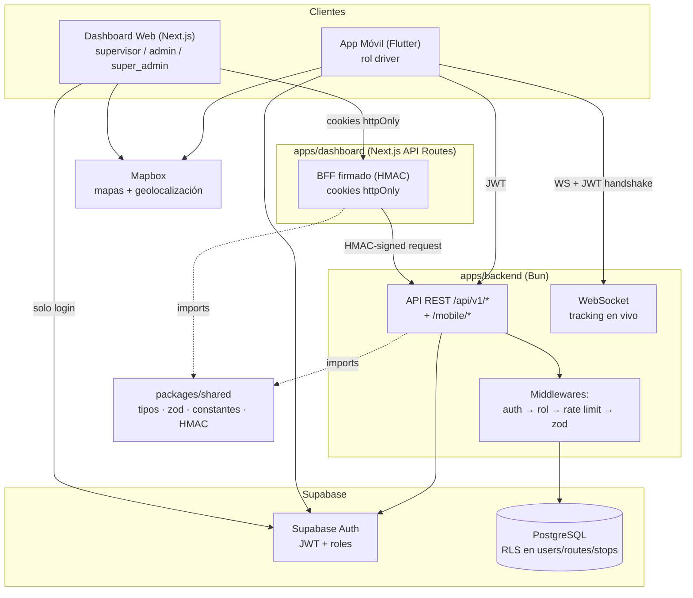

### 3.4 Diagrama de despliegue

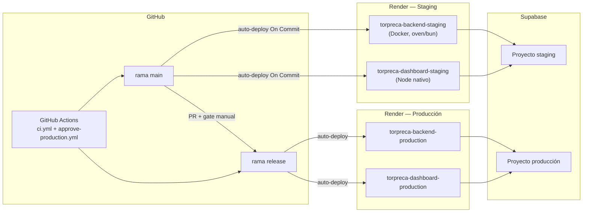

### 3.5 Decisiones técnicas clave

| Decisión | Justificación |
|---|---|
| Bun en vez de Node.js para el backend | Runtime + test runner + gestor de paquetes en una sola herramienta; WebSocket nativo sin librerías adicionales. |
| BFF firmado (HMAC) en el dashboard | El backend exige firma HMAC en todo `/api/*`; el navegador no puede guardar el secreto, por lo que el dashboard necesita un proxy server-side que firme por él. |
| Cookies httpOnly en el dashboard | Migración desde `localStorage` para tokens: elimina exposición a XSS del JWT de sesión (ver `context/dashboard/TOR-124-httponly-cookies-migration.md`). |
| Supabase (Auth + Postgres) en vez de stack propio | Evita reinventar autenticación/roles/JWT y aprovecha RLS nativo de Postgres; acelera el desarrollo con un solo desarrollador en el equipo. |
| `packages/shared` como paquete workspace | Contratos de datos (zod) y constantes de dominio en un solo lugar, consumidos con el mismo tipo tanto en backend como dashboard — evita divergencia de validaciones. |
| Entornos staging/producción separados con gate manual | Producción nunca se despliega automáticamente; requiere PR `main → release` con aprobación humana vía GitHub Environment protection rule. |
| Migraciones de base de datos trackeadas (Supabase CLI) | Reemplaza el flujo manual de pegar SQL en el dashboard de Supabase; da historial versionado y reproducible del esquema. |

---

## 4. Casos de uso

### 4.1 Actores

| Actor | Descripción |
|---|---|
| **Driver (conductor)** | Usa la app móvil para ejecutar su ruta diaria. |
| **Supervisor** | Usa el dashboard para ver y gestionar rutas y monitoreo en vivo. |
| **Admin** | Acceso completo al dashboard salvo logs de auditoría. |
| **Super Admin** | Acceso completo, incluida la pantalla de logs de auditoría. Solo se asigna directamente en la base de datos, nunca desde la UI. |

### 4.2 Diagramas de casos de uso

Se separan por sistema (app móvil vs. dashboard), siguiendo el mismo criterio usado en la documentación técnica de Notion (`Documentación Técnica (UML / ERD)` → Diagramas 2 y 3), actualizados aquí para reflejar el estado real de la implementación (estados `pending/active/rejected/deactivated`, endpoints `/mobile/*`, favoritos y calculadora de km).

**Diagrama de casos de uso — Conductor (app móvil)**

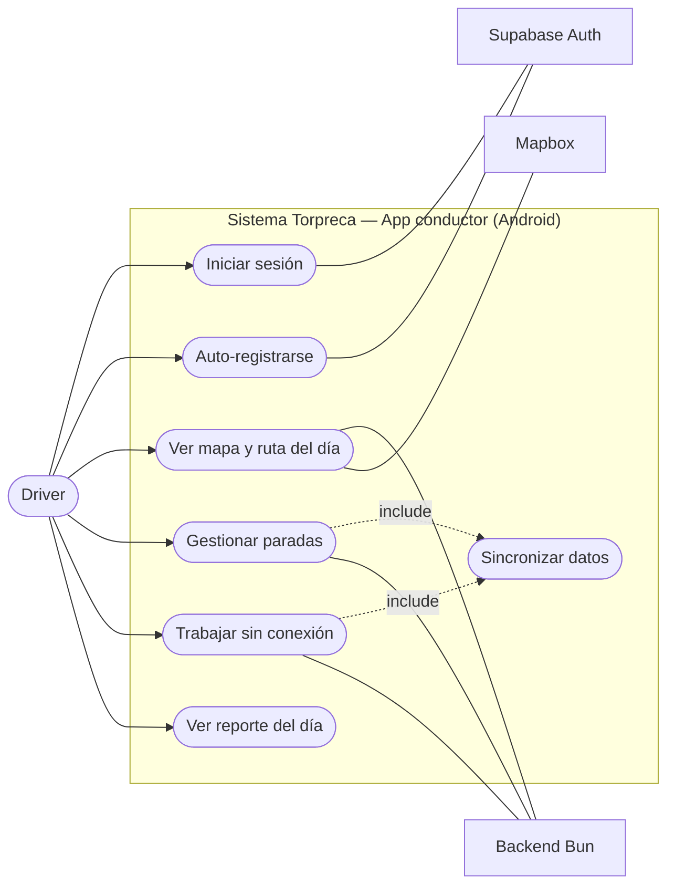

**Diagrama de casos de uso — Dashboard (supervisor / admin / super admin)**

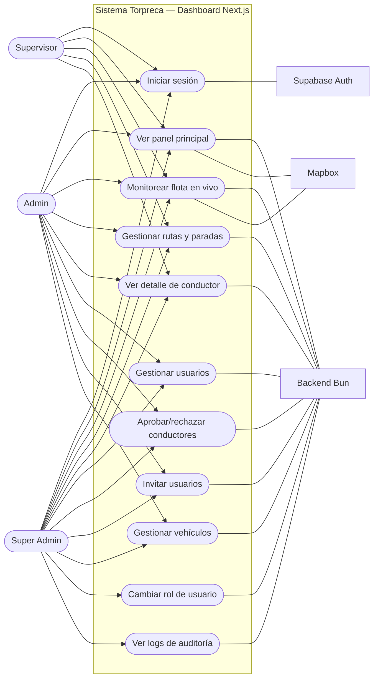

> Nota: `UC10 — Cambiar rol` está disponible para admin/super_admin vía `PATCH /users/:id/role`, salvo la asignación del rol `super_admin`, que solo puede hacerse directamente en la base de datos.

### 4.3 Casos de uso principales (detallados)

**CU-01 — Iniciar sesión**
- **Actor:** cualquier rol.
- **Precondición:** usuario con cuenta `active` en Supabase Auth.
- **Flujo principal:** el usuario ingresa credenciales → se valida con zod → se autentica contra Supabase Auth → se emite JWT → (dashboard) se setean cookies httpOnly; (mobile) el token se guarda en el cliente Supabase Flutter.
- **Flujo alterno:** credenciales inválidas → evento `auth.login_failed` registrado en `audit_logs` → mensaje de error.
- **Postcondición:** evento `auth.login` registrado; usuario navega a su home según rol.

**CU-02 — Auto-registro de conductor**
- **Actor:** driver (usuario nuevo).
- **Flujo principal:** el conductor completa el formulario de registro en la app → cuenta creada con `status = pending` → evento `auth.registered`.
- **Postcondición:** el conductor no puede operar hasta que un admin apruebe su cuenta (`user.approved`) — el `AuthGate` de la app verifica el `status` antes de mostrar el Home.

**CU-03 — Marcar parada como completada/retrasada**
- **Actor:** driver.
- **Precondición:** ruta en estado `in_progress`, parada visible en su lista.
- **Flujo principal:** el conductor selecciona la parada → confirma acción → si hay conexión, `PATCH /mobile/stops/:id/complete|delay` inmediato; si no hay conexión, la acción se guarda en `sync_queue` local (SQLite/Hive) con `sincronizado: false`.
- **Postcondición:** evento `stop.completed` o `stop.delayed` en `audit_logs`; al reconectar, la cola se drena cronológicamente vía `POST /sync` (evento `sync.completed`).

**CU-04 — Monitorear flota en vivo**
- **Actor:** supervisor/admin/super_admin.
- **Flujo principal:** el dashboard abre una conexión WebSocket autenticada (JWT en el handshake) → recibe actualizaciones de ubicación de los conductores activos → el mapa (Mapbox) se actualiza en vivo.

**CU-05 — Gestionar usuarios**
- **Actor:** admin/super_admin.
- **Flujo principal:** listar usuarios (paginado) → crear (`POST /users`, restringido a `super_admin`), desactivar, aprobar/rechazar conductores pendientes, invitar por email (self-service), cambiar rol (`PATCH /users/:id/role`).
- **Regla de negocio:** un `super_admin` **no puede crearse desde la UI**, solo directamente en la base de datos.

**CU-06 — Consultar logs de auditoría**
- **Actor:** super_admin exclusivamente.
- **Flujo principal:** la pantalla de logs solo renderiza si `rol === 'super_admin'` → `GET /audit-logs` con paginación y filtros server-side → 16 tipos de evento disponibles para consulta.

---

## 5. Diagramas UML

### 5.1 Diagrama de entidades (dominio)

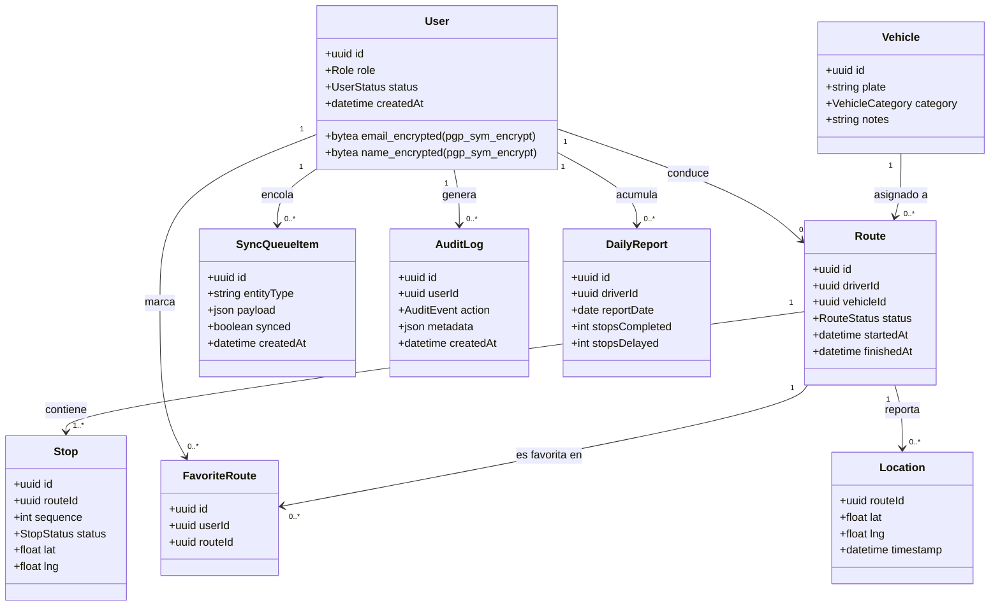

### 5.2 Diagrama de secuencia — Login (dashboard, BFF firmado)

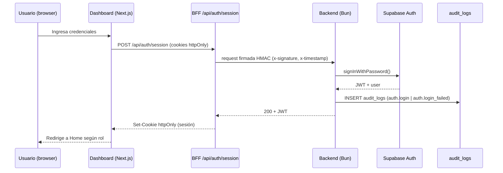

### 5.3 Diagrama de secuencia — Tracking en vivo (WebSocket)

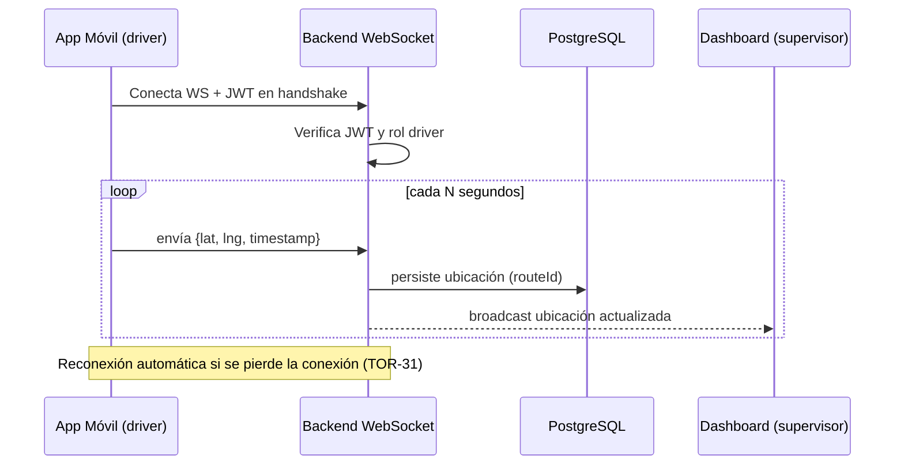

### 5.4 Diagrama de secuencia — Sincronización offline → online

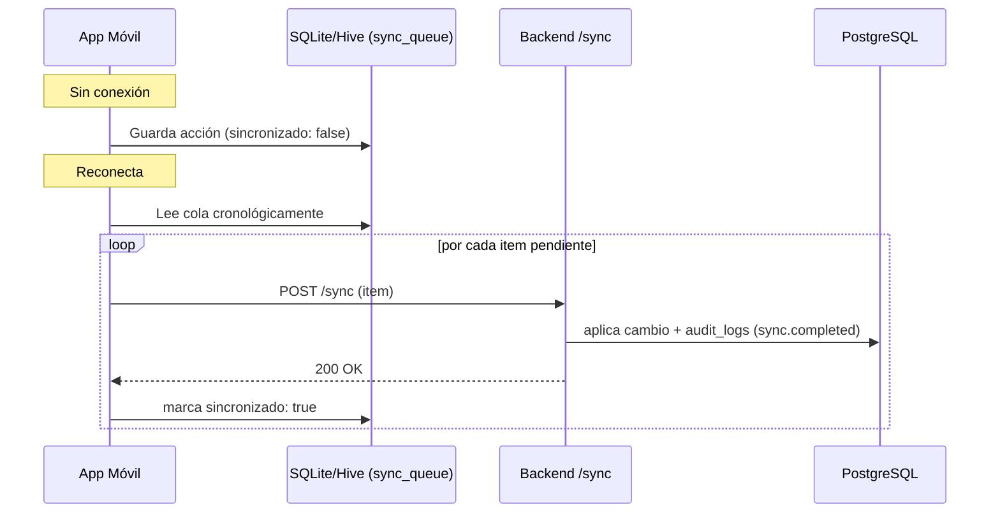

### 5.5 Diagrama de secuencia — Auto-registro y aprobación de conductor

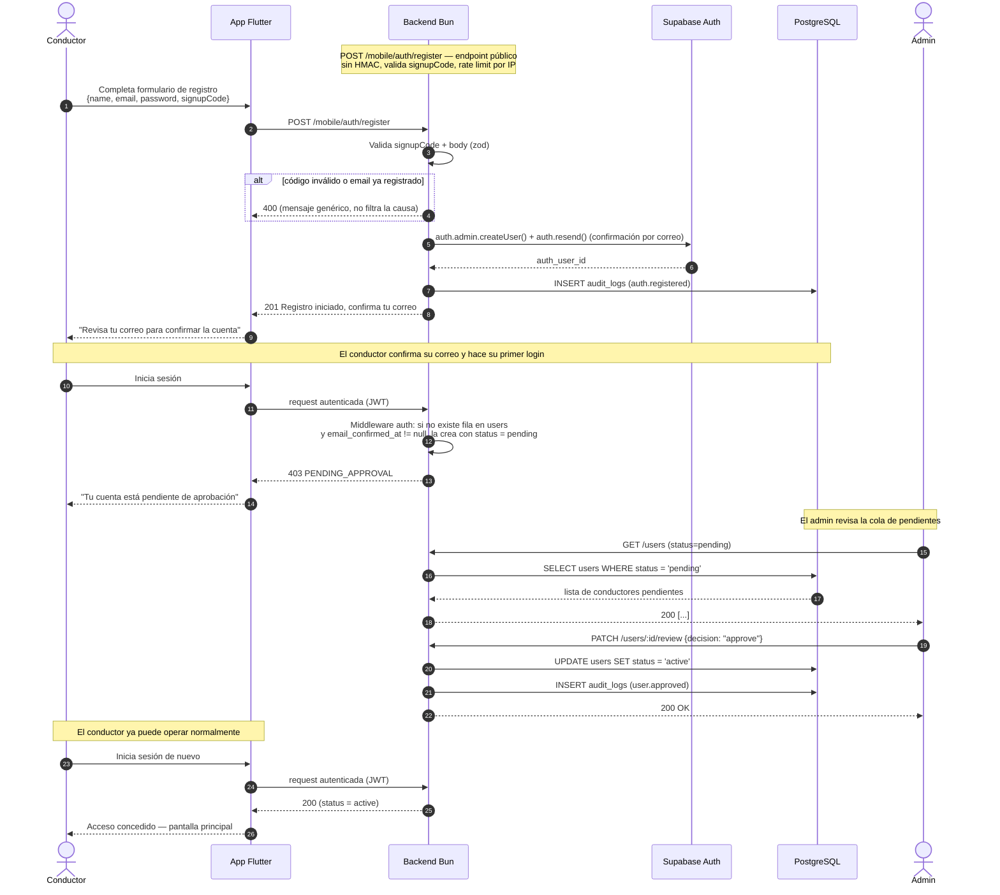

### 5.6 Diagrama de secuencia — Creación de ruta y ejecución por el conductor

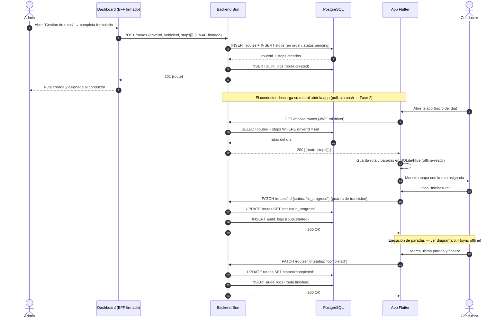

### 5.7 Diagrama entidad-relación (simplificado)

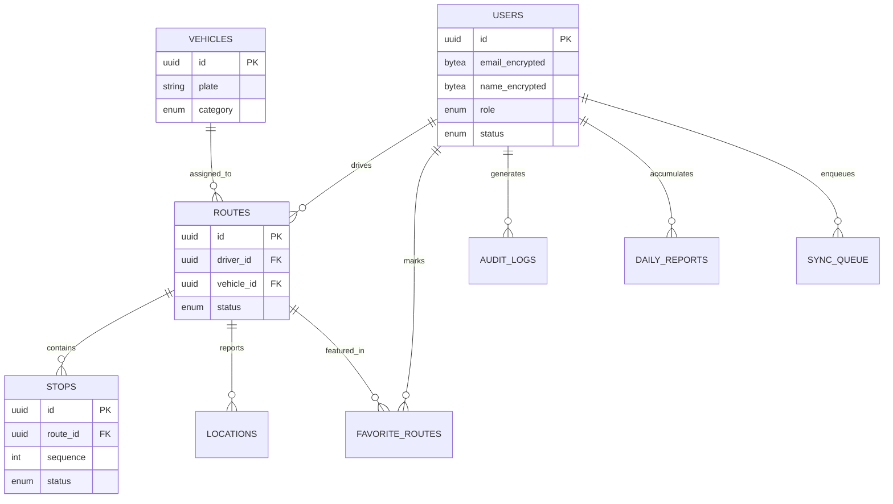

---

## 6. Stack tecnológico

| Capa | Tecnología | Justificación |
|---|---|---|
| Backend | **Bun** + TypeScript | REST + WebSocket nativo sin dependencias externas; test runner y package manager integrados; arranque rápido para un equipo pequeño. |
| Dashboard | **Next.js 14+** (App Router) + pnpm + TypeScript | SSR/BFF en un solo framework, ecosistema maduro de React, API Routes usadas como capa de firma HMAC. |
| Mobile | **Flutter** (solo Android) | Un solo código base, Material Design 3 nativo, buen soporte de paquetes para mapas (`mapbox_maps_flutter`) y almacenamiento local (SQLite/Hive). |
| Landing | **Next.js** + pnpm | Reutiliza el mismo stack del dashboard para la página de presentación pública. |
| Auth | **Supabase Auth** (JWT + roles) | Evita implementar autenticación propia; JWT verificable en backend y RLS integrado con Postgres. |
| Base de datos | **PostgreSQL en Supabase** | RLS nativo, funciones `pgp_sym_encrypt`/`pgp_sym_decrypt` para cifrado de datos sensibles, migraciones versionadas vía Supabase CLI. |
| Mapas | **Mapbox** (web y `mapbox_maps_flutter` en mobile) | Un solo proveedor de mapas para ambas plataformas, con buen soporte de estilos personalizados y tracking en vivo. |
| Validación | **zod** (compartido vía `packages/shared`) | Un único conjunto de schemas consumido por backend y dashboard — validación de inputs y contratos de API sin duplicación. |
| Linter/Formatter | **Biome** (backend/shared) + ESLint (dashboard/landing) | Biome para el código en Bun/TS puro; se mantiene ESLint donde Next.js ya lo trae integrado, evitando una migración forzada de todo el monorepo. |
| Git hooks | **Husky + lint-staged** | `pre-commit` corre lint solo sobre archivos en stage; `pre-push` corre la suite completa de tests + lint como último gate local. |
| CI/CD | **GitHub Actions** + **Render** (staging/producción) | Auto-deploy nativo de Render por rama (`main` → staging, `release` → producción), con gate de aprobación manual vía GitHub Environment protection rule. |
| Notificaciones (Fase 2) | FCM | Diseñado pero explícitamente fuera del alcance del MVP. |

---

## 7. Seguridad

### 7.1 Pipeline de toda request al backend

```
auth (JWT) → rol (requireRole) → rate limit → validación zod → handler
```

### 7.2 Mecanismos implementados

- **Autenticación:** JWT emitido por Supabase Auth, verificado en cada request al backend.
- **Autorización por rol:** middleware `requireRole` sobre cada endpoint sensible (ej. `POST /users` solo `super_admin`).
- **Firma de requests (HMAC-SHA256):** todo endpoint `/api/*` exige headers `x-signature` + `x-timestamp`, firmados con `REQUEST_SIGNING_SECRET` sobre `METHOD\npath\ntimestamp\nbody`. Se rechazan timestamps con más de 5 minutos de desfase (protección contra *replay attacks*). Los endpoints `/mobile/*` quedan exceptuados de esta firma porque el conductor no pasa por un BFF — la superficie que sí protegen es JWT + rol.
- **Cookies httpOnly** en el dashboard: el JWT de sesión nunca es accesible desde JavaScript del navegador (mitiga XSS), migrado desde `localStorage` (`@supabase/ssr`).
- **Cifrado de datos sensibles:** `name` y `email` del usuario se almacenan cifrados (`pgp_sym_encrypt(valor, SECRET_KEY)`, columnas `bytea`) y se descifran con `pgp_sym_decrypt` al leer (función `get_users_readable`, con `COALESCE` durante la migración de backfill). El cifrado de `email` se agregó después (TOR-134, 16 sep 2026) mediante dos migraciones separadas: la primera agregó `email_encrypted` y backfilleó las filas existentes sin tocar la columna original (zero-downtime); la segunda, aplicada solo tras confirmar el backfill al 100% en ambos ambientes, eliminó la columna `email` en texto plano (`DROP COLUMN`).
- **Row Level Security (RLS):** activo en las tablas `users`, `routes` y `stops`; el resto de tablas usa RLS sin políticas, accesibles solo vía `service_role key` desde el backend.
- **Rate limiting:** máximo 5 intentos de login por minuto por IP; máximo 60 requests/minuto en general.
- **CORS restringido:** solo orígenes declarados en `ALLOWED_ORIGINS` (distinto por entorno — staging y producción nunca comparten origen permitido).
- **Cabeceras de seguridad:** `X-Content-Type-Options`, `X-Frame-Options`, `HSTS`.
- **WebSocket autenticado:** el handshake inicial exige JWT válido antes de aceptar la conexión; al desactivarse un usuario, sus conexiones WebSocket activas se cierran de inmediato (TOR-122).
- **Registro de auditoría:** 16 eventos cubiertos end-to-end (ver tabla 7.3), consultables solo por `super_admin` vía `GET /audit-logs` con paginación server-side.

### 7.3 Eventos de auditoría (`AUDIT_EVENTS`)

| Evento | Disparado por |
|---|---|
| `auth.login` / `auth.login_failed` / `auth.logout` | Login dashboard y mobile |
| `auth.registered` | Auto-registro de conductor |
| `user.created` / `user.deactivated` | Gestión de usuarios |
| `user.approved` / `user.rejected` | Aprobación de conductores pendientes |
| `route.created` / `route.updated` / `route.started` / `route.finished` | Ciclo de vida de rutas |
| `stop.completed` / `stop.delayed` | Acciones del conductor sobre paradas |
| `sync.completed` | Drenado exitoso de la cola offline |
| `access.denied` | Middleware de auth/rol rechazando una request |

### 7.4 Separación de entornos

Producción y staging usan **proyectos de Supabase separados** (credenciales, datos y esquema independientes) y **secrets propios de `REQUEST_SIGNING_SECRET`** por entorno — un valor filtrado o mal configurado en staging no compromete producción. El despliegue a producción exige un PR `main → release` con aprobación manual (nadie puede promover un cambio sin ese paso, ni siquiera el propio autor sin pasar por el gate de GitHub Environments).

---

## 8. Estado de avance y cronograma

### 8.1 Línea de tiempo del semestre

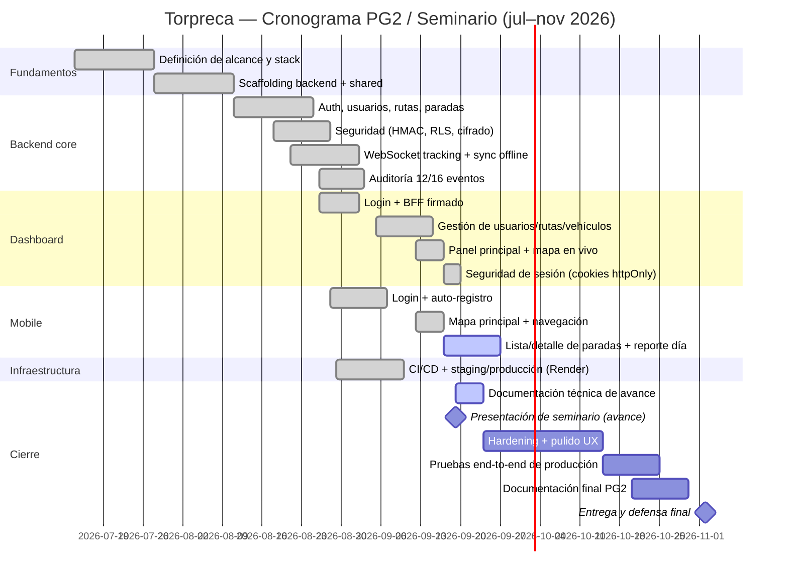

> Nota: las fechas de "Fundamentos" al 18 de agosto son una reconstrucción aproximada a partir del inicio de semestre (14 de julio); desde el 26 de agosto en adelante las fechas están tomadas de los registros reales de `context/` y PRs mergeados.

### 8.2 Resumen de avance por módulo

| Módulo | Estado | Detalle |
|---|---|---|
| Backend — Auth, usuarios, roles | ✅ Completo | Login dashboard + mobile, auto-registro, aprobación, cambio de rol, invitación self-service. |
| Backend — Rutas y paradas | ✅ Completo | CRUD + estados, endpoints mobile sin HMAC, tests e2e del "driver day flow". |
| Backend — Tracking WebSocket | ✅ Completo | Conexión autenticada, broadcast en vivo, cierre de conexión al desactivar usuario. |
| Backend — Sync offline | ✅ Completo | `sync_queue`, endpoint `POST /sync`, drenado cronológico. |
| Backend — Auditoría | ✅ Completo | 16 eventos, endpoint paginado `GET /audit-logs`. |
| Backend — Reportes diarios | ✅ Completo | Módulo `daily-reports` consolidado por conductor/día. |
| Dashboard — Auth y sesión | ✅ Completo | BFF firmado, cookies httpOnly, inactivity timeout, sync de sesión. |
| Dashboard — Gestión (usuarios/rutas/vehículos) | ✅ Completo | Pantallas con TanStack Query, formularios con react-hook-form + zod. |
| Dashboard — Panel principal | ✅ Completo | Métricas + mapa Mapbox en vivo. |
| Dashboard — Logs de auditoría | ✅ Completo | Solo `super_admin`, paginación/filtros server-side. |
| Mobile — Login/registro | ✅ Completo | Login, auto-registro, `AuthGate` con verificación de `status`. |
| Mobile — Mapa y navegación | ✅ Completo | Mapa principal Mapbox, bottom navigation de 4 tabs. |
| Mobile — Paradas y reporte del día | 🔄 En progreso | Detalle de parada y acciones completado; reporte del día en curso. |
| Infraestructura — CI/CD | ✅ Completo (staging) | Staging validado end-to-end; producción configurada, pendiente de primera promoción real. |
| Documentación técnica de avance | 🔄 En progreso | Este documento. |

### 8.3 Pendientes hacia la entrega final (noviembre 2026)

- Completar el módulo de reporte del día en mobile.
- Primera promoción real `main → release` a producción (gate de aprobación ya configurado).
- Verificación manual end-to-end de `audit_logs` contra datos reales en producción.
- Compra de dominio propio y configuración de subdominios (`api.`, `app.` + variantes de staging).
- Hardening de UX y revisión de accesibilidad en dashboard y mobile.
- Documentación final de PG2 (memoria completa, no solo el avance de seminario).

---

## 9. Manual técnico

### 9.1 Requisitos previos

- [Bun](https://bun.sh) (backend, `packages/shared`).
- Node.js 22+ y [pnpm](https://pnpm.io) (dashboard, landing).
- [Flutter SDK](https://flutter.dev) con Android SDK (mobile).
- Cuenta de Supabase (proyecto de desarrollo/staging).
- Token de [Mapbox](https://mapbox.com).

### 9.2 Estructura del monorepo

Ver diagrama en sección 3.1. Los workspaces están declarados en dos gestores distintos por diseño: `package.json` raíz (`workspaces`) para Bun (backend + shared), y `pnpm-workspace.yaml` para pnpm (dashboard + landing + shared) — `packages/shared` es miembro de ambos.

### 9.3 Variables de entorno

**`apps/backend/.env`**
```
SUPABASE_URL=
SUPABASE_ANON_KEY=
SUPABASE_SERVICE_ROLE_KEY=
SECRET_KEY=
REQUEST_SIGNING_SECRET=
PORT=3000
ALLOWED_ORIGINS=
```

**`apps/dashboard/.env.local`**
```
NEXT_PUBLIC_SUPABASE_URL=
NEXT_PUBLIC_SUPABASE_ANON_KEY=
NEXT_PUBLIC_BACKEND_URL=
NEXT_PUBLIC_MAPBOX_TOKEN=
```

**`apps/mobile/.env`**
```
SUPABASE_URL=
SUPABASE_ANON_KEY=
BACKEND_URL=
MAPBOX_TOKEN=
```

> `REQUEST_SIGNING_SECRET` debe ser **idéntico** entre backend y dashboard del mismo entorno (staging↔staging, producción↔producción); un desfase rompe silenciosamente la validación HMAC.

### 9.4 Levantar el proyecto en local

```bash
# Backend
cd apps/backend
bun install
bun run dev

# Dashboard
cd apps/dashboard
pnpm install
pnpm dev

# Mobile
cd apps/mobile
flutter pub get
flutter run --flavor staging   # o production, según Run Config
```

**Tests del backend:** siempre `bun run test` desde la raíz del monorepo (o `bun test` parado dentro de `apps/backend`) — **nunca** `bun test` suelto desde la raíz, porque el `.env` que se carga depende del `cwd` y el `.env` histórico de la raíz no tiene todas las variables que exige `apps/backend/.env`.

### 9.5 Calidad de código

- **Biome** (`apps/backend`, `packages/shared`): `bun run lint`, `bun run lint:fix`, `bun run format`.
- **ESLint**: propio de `apps/dashboard` y `apps/landing` (no unificado con Biome).
- **Husky + lint-staged**: `pre-commit` corre lint solo sobre archivos en stage; `pre-push` corre la suite completa de `bun test` del backend + `bun run lint`. Se instalan solos con `bun install` (script `prepare`).

### 9.6 CI/CD y despliegue

- **Ramas:** `main` (integración, fuente de staging) y `release` (solo recibe merges vía PR desde `main`, fuente de producción).
- **`ci.yml`:** corre en PRs hacia `main` y `release`, con jobs separados por app filtrados por `paths:` (`backend-and-shared`, `dashboard`); `packages/shared` dispara ambos jobs.
- **`approve-production.yml`:** gate de aprobación manual sobre PRs `main → release`, implementado con un GitHub Environment protection rule (permite auto-aprobación del propio autor, a diferencia de un review de PR clásico).
- **Render:** 4 servicios (`backend`/`dashboard` × `staging`/`producción`), Auto-Deploy **"On Commit"** en los 4 (no "After CI Checks Pass" — ver incidente documentado en `context/infra/deploy-plan-cicd.md`, punto 12).
- **Rollback:** un clic en Render (Deploys → deploy anterior → Rollback), sin tooling propio.

### 9.7 Migraciones de base de datos

Desde el 29 de agosto de 2026, **ningún cambio de esquema se aplica a mano** en el SQL Editor de Supabase — todo pasa por migraciones versionadas con el **Supabase CLI**, aplicadas de la misma forma a ambos entornos.

**Estado inicial:** `supabase/migrations/20260829231439_initial_schema.sql` es la migración base, generada con `supabase db pull` contra producción (9 tablas, 9 funciones RPC, 5 tipos enum, 11 políticas RLS en ese momento). Quedó marcada como ya aplicada en el historial de producción y se empujó a staging con `supabase db push`.

**Flujo para un cambio de esquema nuevo:**
1. `npx supabase link --project-ref <ref-producción>` (una vez por sesión/máquina; el CLI recuerda el link en `supabase/.temp/`, ignorado por git).
2. `npx supabase migration new <descripción-corta>` — crea un archivo vacío con timestamp en `supabase/migrations/`; el SQL (`CREATE TABLE`, `ALTER TABLE`, nuevas funciones RPC, etc.) se escribe a mano.
3. Se aplica primero a **staging**: `npx supabase db push --db-url "<connection string de staging>"`.
4. Verificado en staging, se aplica el mismo archivo a **producción**: `npx supabase db push` (apunta al proyecto linkeado) o con `--db-url` explícito.
5. Se hace commit del archivo de migración — es el registro de qué corrió y dónde. Ambos entornos deben quedar siempre en la misma versión de migración; si divergen, `supabase db push --dry-run` contra cada uno muestra lo pendiente.

**Patrón zero-downtime para cambios destructivos** (usado en TOR-134, cifrado de `email`): un cambio que elimina o reemplaza una columna se separa en dos migraciones — la primera solo agrega columnas/funciones nuevas y migra datos (backfill) sin romper lo existente; la segunda, destructiva (`DROP COLUMN`, etc.), se escribe y aplica únicamente después de confirmar manualmente (vía consulta de solo lectura) que el backfill quedó completo al 100% en ambos ambientes.

**Por qué no `supabase db diff` desde Studio:** es una alternativa válida, pero escribir la migración a mano primero mantiene el SQL Editor de Supabase solo para *consultar/inspeccionar*, no para cambiar el esquema — evita volver a caer en el problema original de "el cambio real solo existe en la base de datos viva".

### 9.8 Convenciones de código

- TypeScript estricto en todo el proyecto — sin `any` salvo caso extremo documentado.
- Código (variables, funciones, tipos, comentarios, mensajes de error de la API) **100% en inglés**; la traducción es/en de cara al usuario final se resuelve en cada app cliente con un diccionario i18n propio (pendiente de implementar).
- `snake_case` en la base de datos, `camelCase` en TypeScript, `kebab-case` en nombres de archivo — la capa `*.repository.ts` es la costura de *casing* entre ambos mundos.
- Toda tabla, columna y valor de enum de la base de datos está en inglés.
- Validación de inputs con zod antes de tocar la base de datos, en todos los endpoints.
- Sin credenciales hardcodeadas — todo vía variables de entorno.

---

## 10. Manual de usuario

### 10.1 Conductor (app móvil)

1. **Registro:** abrir la app → "Registrarse" → completar datos (incluye el código de invitación/registro) → confirmar el correo → la cuenta queda en estado *pendiente de aprobación*.
2. **Inicio de sesión:** ingresar correo y contraseña. Si la cuenta aún no fue aprobada por un administrador, la app muestra "Tu cuenta está pendiente de aprobación" y no permite continuar; si fue rechazada o desactivada, muestra el mensaje correspondiente.
3. **Navegación principal:** barra inferior de 4 pestañas — **Mapa**, **Paradas**, **Reporte del día** y **Perfil**.
4. **Mapa:** muestra la ubicación actual del conductor y la ruta asignada del día sobre Mapbox; envía la posición en vivo al backend mientras la ruta está `in_progress`, visible en tiempo real para supervisores/admins en el dashboard.
5. **Paradas:** lista de paradas en el orden planificado. Tocar una parada abre su detalle (dirección, instrucciones) con dos acciones: marcar **Completada** o marcar **Retrasada**. Si no hay conexión, la acción se guarda localmente y se sincroniza automáticamente al recuperar señal (indicador de "pendiente de sincronizar" mientras tanto).
6. **Reporte del día:** resumen de paradas completadas/retrasadas y avance de la ruta activa.
7. **Perfil:** datos del conductor y cierre de sesión.

### 10.2 Supervisor (dashboard)

1. **Inicio de sesión:** correo y contraseña provistos por un administrador. Tras 15 minutos de inactividad, la sesión se cierra automáticamente y, al volver a autenticarse, regresa a la pantalla donde se quedó (`returnTo`).
2. **Panel principal:** métricas generales y mapa en vivo (Mapbox) con la posición de cada conductor activo, actualizada por WebSocket.
3. **Gestión de rutas:** listado de rutas con su estado (`pending`, `in_progress`, `completed`, `delayed`, `cancelled`) y detalle de paradas de cada una. Incluye:
   - **Calculadora de km en el mapa:** herramienta para trazar y medir distancia directamente sobre el mapa al crear/editar una ruta.
   - **Rutas favoritas:** marcar rutas de uso frecuente para acceso rápido, compartidas entre todos los usuarios del dashboard.
4. **Detalle de conductor:** historial de rutas de un conductor específico, su estado operativo en vivo y su mapa individual.

### 10.3 Administrador (dashboard)

Incluye todo lo del supervisor, más:

1. **Gestión de usuarios:** ver listado paginado, revisar la cola de conductores pendientes de aprobación (aprobar/rechazar), desactivar usuarios, cambiar de rol (excepto asignar `super_admin`, que solo puede hacerse directamente en la base de datos), e **invitar nuevos usuarios por correo** (flujo self-service: se envía un enlace/código, la persona invitada completa su propio registro).
2. **Gestión de vehículos:** alta, edición (categoría — moto/vehículo liviano/camión —, notas) de las unidades de la flota.
3. **Gestión de rutas:** creación y edición de rutas y sus paradas asociadas, incluida la asignación de conductor y vehículo.

### 10.4 Super Administrador (dashboard)

Incluye todo lo del administrador, más:

1. **Logs de auditoría:** única pantalla exclusiva de este rol — permite consultar, con filtros (por tipo de evento, usuario, fecha) y paginación server-side, los 16 eventos registrados por el sistema (accesos, cambios sobre usuarios, rutas, paradas y sincronización).

> El rol `super_admin` no aparece como opción asignable desde ninguna pantalla del dashboard — es una medida de seguridad deliberada; su asignación requiere acceso directo a la base de datos.

---

## 11. Conclusiones y próximos pasos

A la fecha de este documento, el sistema cuenta con un **backend funcional y probado** (autenticación, rutas, paradas, tracking en vivo, sincronización offline y auditoría completa), un **dashboard operativo** para los tres roles administrativos, y una **app móvil** con las funciones críticas del conductor implementadas, faltando cerrar únicamente el módulo de reporte del día. La infraestructura de despliegue (CI/CD, entornos separados, gate de aprobación de producción) está validada en staging y lista para su primera promoción real a producción.

**Próximos pasos hacia la entrega final de PG2 (2 de noviembre de 2026):**
1. Cerrar el módulo de reporte del día en mobile.
2. Ejecutar la primera promoción a producción y verificar el flujo completo end-to-end con datos reales.
3. Comprar dominio propio y configurar subdominios definitivos.
4. Hardening de UX y accesibilidad en dashboard y mobile.
5. Redactar la memoria final de PG2, incorporando resultados de las pruebas end-to-end en producción.

---

*Documento generado como parte del proceso de documentación técnica del proyecto Torpreca — Corporación Torpreca, S.A. / UMG Guatemala.*